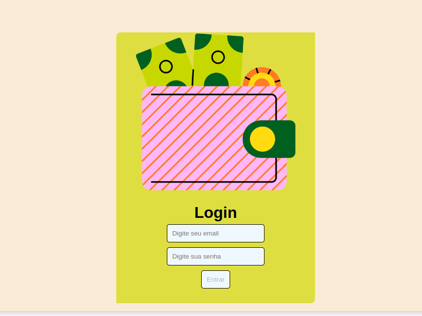
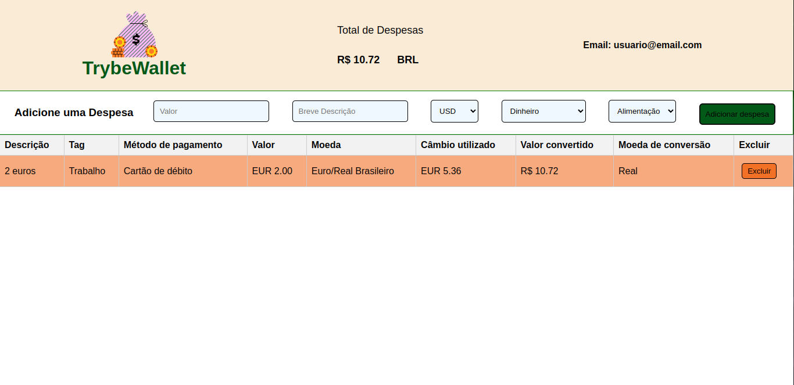

# Wallet

Uma página para registrar despesas com cotação de moeda. Cotações feitas de uma API.              
[Acesse aqui a página](https://wallet-lovat-five.vercel.app/)

## Funcionalidades

- Adicionar uma despesa

- Selecionar o câmbio

- Selecionar tipo de despesa e escrever breve descrição

- Remover uma despesa

## Apêndice

A aplicação foi feita com React, utilição componentização e estado global, e requisições de uma API de câbio

## Screenshots

## Autores

[Alessandra Romualdo](https://www.linkedin.com/in/alessandra-romualdo/)

